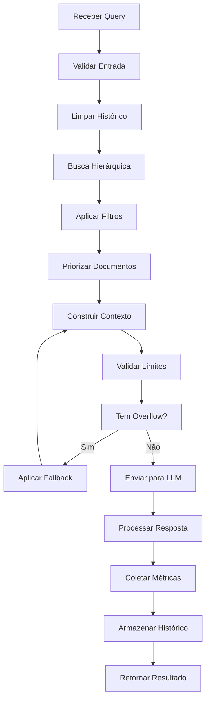

# Fluxo de Trabalho para Gestão de Contexto em Agentes de IA

## 1. Análise da Arquitetura Atual (Completa)

### 1.1 Pontos de Falha Identificados

**Construção de Prompt Sem Controle:**
- Função `_build_prompt()` concatena documentos sem verificação de limites
- Não há contador de tokens ou verificação de capacidade do LLM
- Risco de truncamento silencioso ou erro por limite excedido

**Histórico de Conversa:**
- Campo `history` aceito mas nunca utilizado
- Função `rewrite_query()` é um stub que retorna apenas a query original
- Perda de informação contextual valiosa

**Controle de Documentos:**
- `top_k` configurado mas sem verificação de contexto total
- Documentos podem ter tamanhos variáveis, causando problemas
- Ausência de balanceamento entre qualidade e tamanho

**Ausência de Monitoramento:**
- Nenhuma métrica sobre uso de contexto
- Sem alertas para situações críticas
- Falta de rastreamento de qualidade vs. uso de contexto

## 2. Métricas e Limites de Contexto

### 2.1 Limites por Componente

**LLM (Local - Ollama Phi3:Medium):**
- Limite prático: ~4.000 tokens (do contexto teórico de 32k)
- Margem de segurança: 3.500 tokens
- Reservas: 500 tokens para instrução + 500 para resposta

**Contexto do Sistema:**
- Instruções do sistema: ~200 tokens
- Prompt de controle: ~100 tokens
- **Total do sistema: ~300 tokens**

**Documentos Recuperados:**
- Tokens disponíveis para documentos: 3.200 tokens
- Limitação por documento: max 800 tokens
- Limitação por número: max 8 documentos

**Histórico da Conversa:**
- Tokens máximos para histórico: 500 tokens
- Turnos máximos: 10 interações
- Critério: apenas interações relevantes mantidas

### 2.2 Métricas de Monitoramento

**Métricas de Contexto:**
- `context_tokens_used`: tokens utilizados no contexto
- `context_tokens_limit`: limite máximo de tokens
- `documents_count`: número de documentos incluídos
- `historical_turns`: turnos de histórico incluídos
- `context_efficiency`: razão contextoútil/tototal

**Métricas de Qualidade:**
- `retrieval_precision`: precisão dos documentos recuperados
- `response_relevance`: relevância das respostas
- `context_utilization`: quanto do contexto foi utilizado

**Métricas de Sistema:**
- `query_latency`: latência da consulta
- `memory_usage`: uso de memória durante processamento
- `context_overflow_events`: eventos de estouro de contexto

## 3. Estratégia Multi-Camadas de Gestão de Contexto

### 3.1 Camada de Limpeza e Preparação

**Validação de Entrada:**
```python
def validate_input_context(query: str, history: List[Dict]) -> ValidationResult:
    # Remover mensagens duplicadas no histórico
    # Filtrar interações não relacionadas ao contexto atual
    # Validar tamanho da query e histórico
```

**Limpeza de Histórico:**
- Identificar temas relacionados à query atual
- Remover interações antigas não relacionadas
- Consolidar informações redundantes

### 3.2 Camada de Retrieval Inteligente

**Busca Hierárquica:**
```
Nível 1: Busca específica por tópico
Nível 2: Busca contextual ampliada
Nível 3: Busca de suporte (fallback)
```

**Filtragem por Relevância:**
- Score mínimo configurável (0.6+)
- Diversidade de fontes
- Evitar duplicação de conteúdo

### 3.3 Camada de Priorização de Contexto

**Algoritmo de Priorização:**
1. **Relevância temática** (peso 40%)
2. **Recência da informação** (peso 25%)
3. **Completude da resposta** (peso 20%)
4. **Diversidade de fontes** (peso 15%)

**Processo de Seleção:**
1. Ordenar documentos por score de relevância
2. Calcular eficiência do contexto
3. Selecionar combinação ótima
4. Validar dentro dos limites de tokens

### 3.4 Camada de Construção do Prompt

**Estratégia de Montagem:**
1. Inserir histórico limpo e resumido
2. Adicionar documentos por ordem de prioridade
3. Aplicar template estruturado
4. Validar final de tokens antes do envio

**Template Otimizado:**
```python
CONTEXT_TEMPLATE = """
Histórico relevante:
{historical_context}

Documentos de referência:
{documents_section}

Pergunta: {user_query}
Resposta baseada apenas no contexto fornecido:
"""
```

## 4. Fluxo de Monitoramento e Alertas

### 4.1 Monitoramento em Tempo Real

**Dashboard de Métricas:**
- Uso atual de contexto (tokens/limite)
- Qualidade das respostas recentes
- Eventos de degradação
- Performance do sistema

**Logs Estruturados:**
```python
class ContextMetrics:
    query_id: str
    tokens_used: int
    tokens_limit: int
    documents_count: int
    efficiency_score: float
    processing_time: float
    quality_score: float
```

### 4.2 Sistema de Alertas

**Alertas Críticos (Tratar Imediatamente):**
- Contexto > 95% do limite
- Qualidade da resposta < 60%
- Latência > 120 segundos

**Alertas de Atenção (Monitorar):**
- Contexto > 80% do limite
- Repetição de documentos recuperados
- Picos de uso de memória

### 4.3 Feedback Loop

**Coleta de Feedback:**
- Avaliação automática de qualidade
- Feedback de usuários quando disponível
- Análise de padrões de uso

**Ajustes Adaptativos:**
- Ajuste dinâmico de `top_k` baseado em performance
- Refinamento de scores de relevância
- Atualização de limites baseados em uso real

## 5. Mecanismos de Fallback e Degradação Graciosa

### 5.1 Estratégias de Fallback

**Nível 1 - Otimização Automática:**
- Reduzir `top_k` automaticamente
- Priorizar documentos mais relevantes
- Resumir histórico quando necessário

**Nível 2 - Degradação Controlada:**
- Usar apenas documentos com score > 0.8
- Limitar histórico a últimos 5 turnos
- Aplicar compressão agressiva do contexto

**Nível 3 - Modo de Emergência:**
- Query simplificada sem histórico
- Documento único mais relevante
- Resposta de baixa confiança

### 5.2 Prevenção de Falhas

**Validações Preventivas:**
```python
def validate_context_limit(context: str) -> bool:
    tokens = estimate_token_count(context)
    return tokens <= CONTEXT_TOKEN_LIMIT * 0.95

def ensure_diversity(docs: List[Dict]) -> List[Dict]:
    # Garantir fontes diferentes
    # Evitar conteúdo duplicado
    # Manter equilíbrio de tipos de documento
```

**Circuit Breakers:**
- Desabilitar histórico após falhas consecutivas
- Reduzir complexidade após timeouts
- Priorizar estabilidade sobre completude

## 6. Fluxo de Trabalho Completo

### 6.1 Pipeline de Processamento



### 6.2 Decisões de Fluxo

**Critérios de Decisão:**
- Se `tokens_used > 80%`: aplicar compressão
- Se `quality_score < 70%`: reduzir contexto
- Se `latency > 60s`: ativar modo rápido
- Se `error_rate > 5%`: ativar modo conservador

**Ações Automáticas:**
- Ajuste dinâmico de parâmetros
- Seleção de estratégia de fallback
- Notificação de administradores
- Backup de estado para análise

## 7. Implementação Técnica

### 7.1 Componentes Necessários

**ContextManager:**
- Gestão centralizada de contexto
- Validação e limites
- Métricas e monitoramento

**QueryProcessor:**
- Reescrita inteligente de queries
- Análise de histórico
- Otimização de busca

**DocumentRanker:**
- Ranking avançado de documentos
- Diversidade de fontes
- Score de qualidade

**FallbackController:**
- Seleção de estratégias
- Degradação graciosa
- Circuit breakers

### 7.2 Configurações

**Parâmetros Configuráveis:**
```yaml
context_management:
  token_limits:
    total: 3500
    system: 300
    documents: 3200
    historical: 500
  
  quality_thresholds:
    min_document_score: 0.6
    min_response_quality: 0.7
    max_latency: 60
  
  fallback_strategies:
    aggressive_compression: true
    reduced_top_k: true
    emergency_mode: true
```

Esta estratégia garante que o agente de IA nunca ultrapasse seus limites de contexto, mantendo qualidade e estabilidade através de um sistema multi-camadas de proteção e monitoramento.