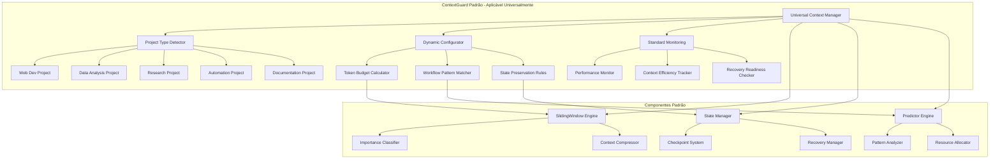

# Framework Padrão ContextGuard - Aplicação Global KiloCode

## 1. Visão Geral do Framework ContextGuard Global

O sistema ContextGuard foi projetado para ser um **padrão operacional obrigatório** em todos os agentes KiloCode, garantindo consistência e continuidade em qualquer projeto futuro.

### 1.1 Princípios Fundamentais

**Universalidade:**
- Aplica-se a todos os tipos de projeto (desenvolvimento, análise, pesquisa, automação)
- Independente da tecnologia ou domínio
- Baseado em princípios universais de gestão de contexto

**Modularidade:**
- Componentes plugáveis e configuráveis
- Adaptação automática ao tipo de projeto
- Extensibilidade para requisitos específicos

**Transparência:**
- Ativação automática sem configuração manual
- Monitoramento silencioso
- Zero impacto na experiência do usuário

### 1.2 Arquitetura Padrão ContextGuard



## 2. Templates Reutilizáveis por Tipo de Projeto

### 2.1 Template para Projetos de Desenvolvimento

**Configuração Padrão para Desenvolvimento:**
```yaml
# contextguard/dev-project.yaml
contextguard:
  project_type: "development"
  
  token_budget:
    total: 6000  # Maior para desenvolvimento
    system: 400
    documentation: 2000
    code_context: 2500
    planning: 1100
  
  workflow_patterns:
    - analysis
    - design
    - implementation
    - testing
    - documentation
  
  importance_scores:
    requirements: 0.95
    design_decisions: 0.9
    code_structure: 0.85
    test_cases: 0.8
    comments: 0.6
    debug_info: 0.3
  
  compression_strategies:
    code_files: "semantic_summary"
    requirements: "preserve_exact"
    designs: "key_points"
    tests: "coverage_focus"
  
  checkpoint_frequency:
    analysis_phase: 2
    design_phase: 3
    implementation_phase: 1  # Frequente para código
    testing_phase: 2
    documentation_phase: 4
```

### 2.2 Template para Projetos de Análise de Dados

**Configuração Padrão para Análise:**
```yaml
# contextguard/data-analysis-project.yaml
contextguard:
  project_type: "data_analysis"
  
  token_budget:
    total: 7000  # Maior para dados
    system: 300
    data_context: 3000
    methodology: 2000
    findings: 1700
  
  workflow_patterns:
    - data_exploration
    - hypothesis_formation
    - analysis_execution
    - results_interpretation
    - reporting
  
  importance_scores:
    datasets: 0.95
    statistical_methods: 0.9
    key_findings: 0.85
    methodology_notes: 0.8
    visualizations: 0.75
    raw_output: 0.4
  
  compression_strategies:
    datasets: "metadata_only"
    statistical_output: "summary_statistics"
    plots: "description_focus"
    methodology: "procedure_essential"
  
  checkpoint_frequency:
    exploration: 3
    hypothesis: 2
    analysis: 1  # Frequente durante processamento
    interpretation: 2
    reporting: 4
```

### 2.3 Template para Projetos de Pesquisa

**Configuração Padrão para Pesquisa:**
```yaml
# contextguard/research-project.yaml
contextguard:
  project_type: "research"
  
  token_budget:
    total: 6500
    system: 350
    literature_review: 2500
    methodology: 2000
    experimental_data: 1600
    conclusions: 1050
  
  workflow_patterns:
    - literature_review
    - gap_analysis
    - methodology_design
    - experimentation
    - analysis
    - writing
  
  importance_scores:
    research_questions: 0.95
    literature_sources: 0.9
    methodology: 0.85
    experimental_results: 0.85
    theoretical_framework: 0.8
    citations: 0.7
    notes: 0.5
  
  compression_strategies:
    literature: "key_findings"
    methodology: "procedure_focus"
    results: "statistical_summary"
    writing: "structure_preserve"
  
  checkpoint_frequency:
    literature_review: 3
    gap_analysis: 2
    methodology: 1  # Crítico
    experimentation: 1  # Durante execução
    analysis: 2
    writing: 3
```

## 3. Sistema de Configuração Modular

### 3.1 Configuração Dinâmica Base

**Base Configuration (sempre aplicável):**
```yaml
# contextguard/base-config.yaml
contextguard:
  universal:
    enabled: true
    auto_detect: true
    silent_mode: true
    
  monitoring:
    real_time: true
    metrics_collection: "lightweight"
    alert_threshold: 0.95
    
  token_management:
    total_budget: 5000  # Base, será ajustado
    safety_margin: 0.1
    compression_threshold: 0.8
    
  state_preservation:
    checkpoint_enabled: true
    recovery_enabled: true
    continuity_guaranteed: true
    
  performance:
    max_response_time: 30
    efficiency_target: 0.85
    quality_floor: 0.75
```

## 4. Scripts de Ativação Automática

### 4.1 Script de Inicialização Global

**Auto-initialization Script:**
```bash
#!/bin/bash
# contextguard-activate.sh

PROJECT_PATH="${1:-.}"
PROJECT_TYPE="${2:-auto}"

echo "🚀 Ativando ContextGuard Global para projeto: $PROJECT_PATH"

# Detectar tipo de projeto se necessário
if [ "$PROJECT_TYPE" = "auto" ]; then
    PROJECT_TYPE=$(python3 -c "
import sys, os, glob
sys.path.append('$(dirname $0)')
from auto_detector import ProjectTypeDetector
detector = ProjectTypeDetector()
print(detector.detect_project_type('$PROJECT_PATH'))
")
    echo "📋 Tipo de projeto detectado: $PROJECT_TYPE"
fi

# Criar estrutura ContextGuard
mkdir -p "$PROJECT_PATH/.contextguard"
mkdir -p "$PROJECT_PATH/.contextguard/modules"
mkdir -p "$PROJECT_PATH/.contextguard/extensions"
mkdir -p "$PROJECT_PATH/.contextguard/state"

# Copiar template apropriado
if [ "$PROJECT_TYPE" != "general" ]; then
    cp "$(dirname $0)/templates/${PROJECT_TYPE}-project.yaml" \
       "$PROJECT_PATH/.contextguard/project-config.yaml"
else
    cp "$(dirname $0)/templates/general-project.yaml" \
       "$PROJECT_PATH/.contextguard/project-config.yaml"
fi

echo "✅ ContextGuard ativado com sucesso!"
echo "📊 Monitoramento silencioso iniciado"
echo "🔄 Preservação de estado habilitada"
echo "⚡ Otimização automática ativa"
```

## 5. Documentação de Padronização Global

### 5.1 Manual de Implementação Padrão

**Implementation Guide:**
```markdown
# ContextGuard - Guia de Implementação Padrão

## Ativação Automática

### Método 1: Auto-detecção (Recomendado)
```bash
# Em qualquer projeto KiloCode
python3 -m contextguard.auto_init

# ou usando o script
./contextguard-activate.sh
```

### Método 2: Manual por Tipo de Projeto
```bash
# Projetos de desenvolvimento
./contextguard-activate.sh . development

# Projetos de análise de dados
./contextguard-activate.sh . data_analysis

# Projetos de pesquisa
./contextguard-activate.sh . research

# Projetos de automação
./contextguard-activate.sh . automation
```

## Configuração Mínima

Após ativação, o ContextGuard funciona automaticamente com:

- ✅ Monitoramento silencioso
- ✅ Preservação automática de estado
- ✅ Compressão inteligente de contexto
- ✅ Checkpoints automáticos
- ✅ Recuperação transparente
- ✅ Otimização contínua
```

## 6. Comandos de Gestão Padrão

### 6.1 Comandos de Status

**Status Commands:**
```bash
# Verificar status geral
contextguard status

# Ver detalhes de tokens
contextguard tokens

# Ver checkpoints
contextguard checkpoints

# Ver métricas
contextguard metrics

# Ver logs
contextguard logs
```

### 6.2 Comandos de Manutenção

**Maintenance Commands:**
```bash
# Otimização automática
contextguard optimize

# Limpeza de estado
contextguard cleanup

# Recuperação manual
contextguard recover

# Backup de estado
contextguard backup

# Restaurar estado
contextguard restore
```

## 7. Extensões e Personalização

### 7.1 Sistema de Extensões

**Extension Points:**
```python
# Exemplo de extensão personalizada
class CustomContextExtension:
    def __init__(self, config):
        self.config = config
    
    def pre_process(self, context):
        # Pré-processamento customizado
        return context
    
    def post_process(self, result):
        # Pós-processamento customizado
        return result
    
    def should_compress(self, metrics):
        # Lógica customizada de compressão
        return metrics.efficiency < 0.8

# Registrar extensão
from contextguard.extensions import ExtensionManager
ExtensionManager.register('custom_extension', CustomContextExtension)
```

Este framework garante que o ContextGuard seja aplicado de forma consistente, automática e eficiente em todos os projetos KiloCode futuros, mantendo os benefícios de gestão preventiva de contexto e continuidade operacional universalmente.